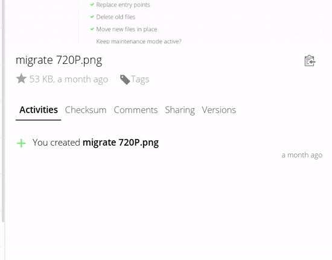

Checksum
========

**Plugin for [Nextcloud](https://nextcloud.com) and [ownCloud](https://owncloud.org) to create hashes of files.**

Installation
------------

**Nextcloud**

In your Instance, simply navigate to »Apps«, choose the category »Files«, find the Checksum app and enable it.

**ownCloud**
- Copy the checksum folder in the app directory of owncloud.
- If not already done, rename the app-folder to "checksum" - causes overwise an sql error.
- Enable this app in the admin interface.

Usage
-----

Just open the details view of the file (Sidebar). There should be a new tab called "Checksum". Select a algorithm and it will try to generate a hash. If you want an other algorithm, just click on the reload button. 

Possible algorithms are md5, sha1, sha256, sha384, sha512 and crc32.

Compatibility
-------------

- I only tested the app for the current version of owncloud (9.x) and Nextcloud 10 and 11.
- I tried to use the current api as much as possible. It should be safe for future versions.
